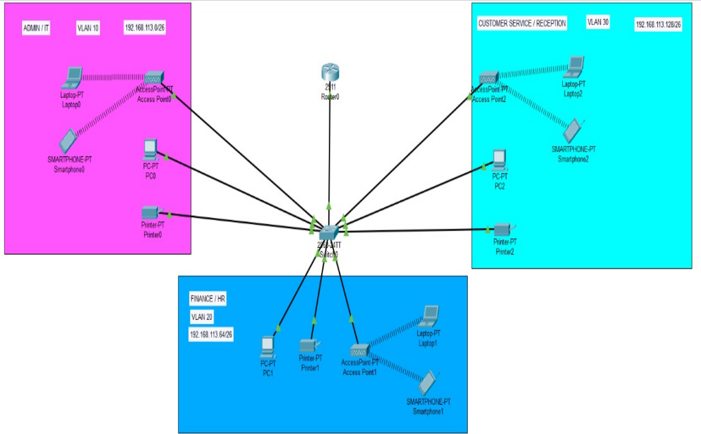

# AASDJ Foods Network Implementation

This repository contains work originally developed in December 2023. The commits are dated according to the original work timeline, but the repository was created on 29th August, 2024 for organizational and archival purposes.

## Overview
In the dynamic landscape of information technology, our group embarked on a comprehensive project to design and implement a robust Small Office Home Office (SOHO) network for AASDJ Foods, a burgeoning company in Lahore, Pakistan. With the vision of expanding its operations, AASDJ Foods sought our expertise to establish an autonomous network for a new branch near the local village of Bonalbo.

This project required meticulous planning and execution to cater to the specific needs of three distinct departments: Admin/IT, Finance/HR, and Customer Service/Reception. Utilizing cutting-edge Cisco technologies, we developed a sophisticated network infrastructure incorporating routers, switches, access points, and a secure wireless communication framework.

## Key Features
- **Network Design:** Comprehensive network planning to accommodate Admin/IT, Finance/HR, and Customer Service/Reception departments.
- **Cisco Technologies:** Utilized advanced Cisco routers, switches, and access points.
- **IP Addressing Scheme:** Implemented a structured IP addressing scheme to ensure efficient resource allocation.
- **DHCP Server Configuration:** Configured DHCP servers to dynamically assign IP addresses.

## Visual Representation
Below is an image illustrating the network implementation:

